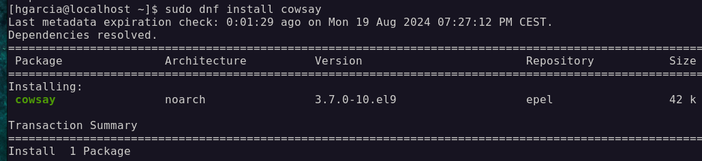

# 2.3. Package Management

Our system connects to **centralized repositories** and they provide a list of available packages (including available versions, and their dependencies) that can then be used to install updates, or install additional tools

1. `$ sudo dnf upgrade` or `dnf update` >> Fetches the latest version of the package list and upgrades our system

   > [!IMPORTANT] > `dnf` always keeps the local package list up to date - we don't have to manually refresh it (in contrast to Ubuntu).

2. `$ sudo dnf install epel-release` >> EPEL is a repository of software packages maintained by the Fedora Project that provides additional packages for RHEL-based distributions.

3. `$ sudo dnf update`

4. `$ sudo crb enable` >> CodeReady Builder is a repository provided by Red Hat that contains additional development and build tools that are not included in the default repositories.

5. `$ sudo dnf update`

6. `$ sudo dnf install cowsay` >> now it will download ir from epel repository

  
 
      Note: `yum` command stills works on CentOS
