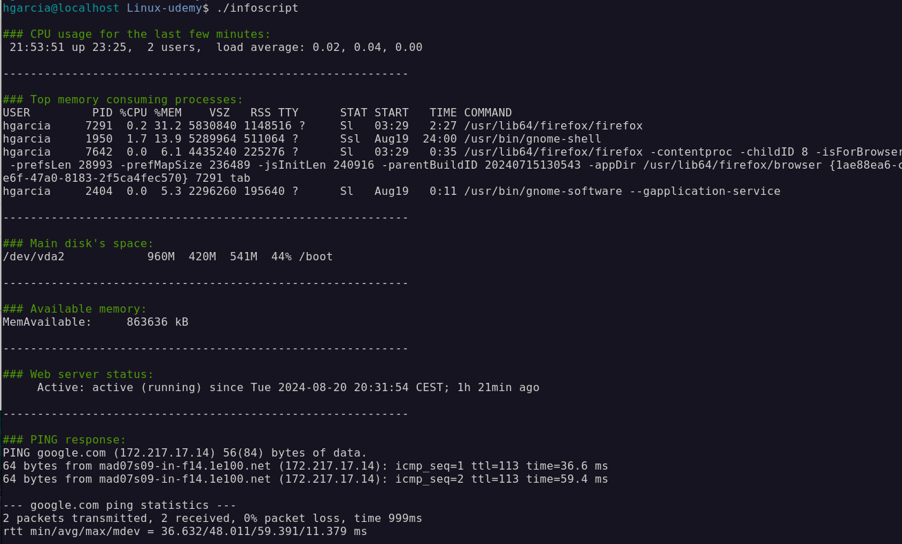

# 4.1. Leveraging variables for dynamic scripts

**Bash: bourne again shell: command-line shell and scripting language on Unix-like systems (automation of repetitive tasks -e.g., creating backups, monitoring servers, evaluating log data,...)**

- Bash is not recommended for longer scripts ("Shell Style guide" by Google)
- A Bash script is plain text file containing a sequence of commands - We can create it with any text editor and then execute the script by invoking bash: `bash script.sh `. Best practices:
  - File extension is not necessary
  - If we use a file extension, we should use something meaningful: `.sh`, `.bash`
  - Do not use a name that also exists as a command name
  - Name should only contain alphanumeric characters and underscore: ` A-Z, a-z, 0-9, \_`
  - We should avoid any other characters

## Shebang

Bash scripts should begin with a shebang at the top, specifying the interpreter for executing the script. An interpreter reads a script line by line, interprets each command, and executes them in sequence

- `#` (sharp) + `!` (bang) = shebang. This is a Unix feature: The statement after `#!` is executed as an interpreter for the script. Example:

```bash
 #!/usr/bin/env bash
  echo 'hello from a bash script'
```

- Bash scripts can then be executed directly: `- ./script` once we make them executable: `chmod +x ./script`
- On macOS, the system version of Bash might be outdated (due to licensing issues). Thus, we might have to install a newer version of Bash. We can't override the system version of Bash (system integrity protection): `#!/usr/bin/env bash` picks the first one found by our PATH variable in our environment.

## Comments

- Comments are ignored during execution - They are used to:
  - provide explanations
  - document code
  - temporarily disable certain parts of the script
- They start with a single `#`
- Sometimes, you might see comments with `:` >> `: I am a comment`
- Technically, `:` stands for NOP, meaning that we execute an empty command (this is not a real comment, and should not be used as such)
- Expansions are still being applied
- Sometimes, you might see a multi-line comment as such:

```bash
  : << 'my_comment'
  This here is the content of the comment. Hello world!
  my_comment
```

- This is also not a comment. Here, we define the contents of a temporary file as a heredoc
  (named it `my_comment`) and send this (as stdin) to the NOP command (:). The single quotes around `my_comment` define that we want to
  disable expansions. But this is still not a comment, it's still an empty command that is being executed so **we should avoid using this!**

## Variables

### Bash variables vs. environment variables

- Bash variables are used to store and manipulate data: They are valid within a shell session and can be defined and used directly in the shell session where data is then stored temporarily.
- Syntax: `variable_name=value` for declaration and assignment (No spaces around the `=`) operator!
- Variables are case-sensitive (`myVar` and `myvar` are different variables)

> [!IMPORTANT]
> There are no data types, all variables in Bash are strings

- To access a variable: we can use variable expansion:

```bash
var='content'
echo "${var}"
```

### Best practice:

- Avoid using special characters or reserved keywords
- Try to use Bash variables, unless you need to use an environment variable
- You can simplify complex commands, by using a variable to turn them into multiple, simpler commands
- Use lowercase characters, and separate words by an underscore: `my_var`

- **Environment variables:**

  - A feature of the operating system
  - They work independently of the program / programming language: They are automatically inherited to child processes

- **Bash variables:**

  - A feature of Bash
  - They work within a single Bash context: They are not inherited to child processes
    Jannis Seemann - Bash & Linux CLI

### How to not declare a variable

- `variable_name= value` >> We create a temporary environment variable `variable_name`
  and set it to `''`. After that, we execute value with this environment variable.
- `variable_name =value` >> Bash will execute `variable_name `as a command with the `parameter =value`. Most likely, the command `variable_name` will not exist, thus yielding an error
- `variable_name = value` >> Bash will execute variable_name as a command with 2 parameters: `=` and `value`

### The command declare

We can also create variables with declare.

- Syntax: `declare [options] variable_name=value`
- Options (examples):
  - `-r` >> declares a read-only variable that cannot be modified
  - `-i` >> Declares an integer variable
  - `-x` >> Declares an environment variable
  - `-p` >> To display all variables

### Deleting / unsetting variables

- Most often we never unset a variable as Bash scripts are not that long anyway and once finished, our whole Bash process is removed from memory anyway.
  - Method 1: We just assign an empty value to a variable: `course_title=` (this does not remove the variable, it still exists -it's just set to the empty string)
  - To really remove a variable: `unset course_title`

### Reading user input

- Use the `read` command to prompt the user for input and store it in a variable: `read -p 'Enter your name: ' name`
- We can also explore additional options: `read --help`

  > [!IMPORTANT]
  > If you're using a different shell (such as zsh), the read command will have different options, `read -p `might not even work then!

- We can also read multiple values with just one read command: `read variable1 variable2`. Here, the input will be split into 2 segments:

  - The first word will be written into the variable `variable1`
  - All the remaining words will be written into` variable2`

- **IFS**: In Bash, the variable IFS controls how whitespace is being handled by certain commands. By default, it contains the following characters:
  - space, tab, newline
  - `IFS=$' \t\n' `
  - Note the $ at the beginning - only this will convert \t into a real tab!
- The input that we provide to the read command will be split along those characters (though the newline character still terminates the read command)
- We can overwrite this variable though!
  - IFS=";" read firstname lastname
  - We can even combine this with process substitution

### File contents to variable

- We can already read the contents of a file to a variable: `file_content="$(cat file.txt)"` >> here, we're using command substitution to execute the `cat` program; then, we collect its output and store it in the variable `file_content`
- But there's a more efficient way to do it: `file_content="$(< file.txt)"`
  - `< `would normally be used for input redirection (= using a file as standard input for a program)
  - But in combination of command substitution and no program there, `<` means that we want to read the contents of the file

## **_EXERCISE_**

Create a system info script

    - ...print the CPU usage of the last few minutes (uptime)
    - ...print the processes that take the most % CPU (ps):
    - ...print the % of free disk space of the main drive (df)
    - ...print how much memory is available on our system:
    - Idea: We can just print out a single line from the file `/proc/meminfo`
    - ...print out if the webserver is running or not:
    - Idea: You can pipe the output of `systemctl status` [unit] into a `grep`
    - ...ping a remote webserver a few times, and print out the whole result

**Solution**

```bash
#!/usr/bin/bash

USAGE=$(uptime)
PROCESSES=$(ps aux --sort=-%mem | head -n 5)
SPACE=$(df -h | grep "/dev/vda2 " )
MEMORY=$(cat /proc/meminfo | grep "MemAvailable")
WEB_SERVER=$(systemctl status nginx | grep 'Active')
PING=$(ping -c 2 google.com)

echo -e "\n\033[0;32m### CPU usage for the last few minutes:\033[0m \n${USAGE}\n"

echo "-----------------------------------------------------------"

echo -e "\n\033[0;32m### Top memory consuming processes:\033[0m \n${PROCESSES}\n"

echo "-----------------------------------------------------------"

echo -e "\n\033[0;32m### Main disk's space:\033[0m \n${SPACE}\n"

echo "-----------------------------------------------------------"

echo -e "\n\033[0;32m### Available memory:\033[0m \n${MEMORY}\n"

echo "-----------------------------------------------------------"

echo -e "\n\033[0;32m### Web server status:\033[0m \n${WEB_SERVER}\n"
# To check whether there's a webserver installed:
# $ sudo netstat -tuln | grep ':80\|:443'
# $ sudo systemctl status httpd
# $ sudo systemctl status nginx
# $ curl -I http://localhost

echo "-----------------------------------------------------------"

echo -e "\n\033[0;32m### PING response:\033[0m \n${PING}\n"

```

  
