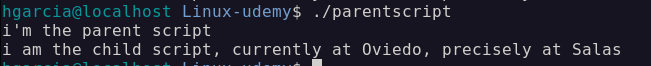

# 4.2. Building robust scripts

## Process substitution

Process substitution can replace a pipe

- This is a normal pipe: ` ls | wc -l` >> The output of the `ls` command is being used as the standard input of the `wc -l` command
- This is process substitution `<(command): wc -l < <(ls)` >> The command `ls` will be executed, it's result will be written to a temporary file and this temporary file will be used as the input for the redirection (which will then load the file into the stdin of `wc -l`)

### Pipe vs. process substitution

Here, it doesn't make any difference:

- Pipe: `- ls | wc -l`
  - `ls` is executed in the main shell
  - `wc -l` is executed in a subshell
- Process substitution: `wc -l < <(ls)`
  - `wc -l `is executed in the main shell
  - `ls` is executed in a subshell

But:

- Pipe: `echo "Linux" | read -r topic`
  - `read -r topic` is executed in a subshell, thus, the variable exists only in the subshell
  - If we try to access this variable after, it will not exist in the main process
- Process substitution: `read -r topic < <(echo "Linux")`
  - `read -r topic` is executed in the main shell, thus, this variable exists after the command

## How to split a Bash script into multiple files

If we want to split a complex script into multiple files:

**We can just launch the other script in a subshell**:

- `bash other-script.sh` / `./other-script` >> But this will launch the other script in a subshell, meaning: We have a different scope for our variables (Only environment variables are inherited from the parent to the other script)

**We can also execute a Bash script in the same context as our current script:**

- ` source [file]` / `source ./other-script.sh`

eg.

```bash
nano parentscript
sudo chmod +x parentscript
nano childscript
```

```bash
#!/usr/bin/bash

export ENV_CITY="Oviedo"
echo "i'm the parent script"
source ./childscript
```

```bash
#!usr/bin/bash

town='Salas'
echo "i am the child script, currently at ${ENV_CITY}, precisely at ${town}"
```

  

## Making our scripts accessible through PATH

A Bash script is just an executable file, if our PATH includes a folder with executable files (no matter of what type), those files can be accessed directly. For this, we can update our PATH variable: `PATH="${PATH}:[new-path]"`

**Best practice:**
If a script should be accessed through PATH

- Bash script **must**:
  - Be executable `(chmod +x)`
  - Have a shebang `(#!/usr/bin/env bash)`
- Bash script **should**:
  - Not have an extension `(my_script instead of my_script.sh)`

eg.

```bash
$ hgarcia@localhost Linux-udemy$ echo $PATH
/home/hgarcia/.local/bin:/home/hgarcia/bin:/usr/local/bin:/usr/local/sbin:/usr/bin:/usr/sbin:/home/hgarcia/Documents/Linux/Linux-udemy

$ hgarcia@localhost Linux-udemy$ pwd
/home/hgarcia/Documents/Linux/Linux-udemy

$ hgarcia@localhost Linux-udemy$ nano executable_path

$ hgarcia@localhost Linux-udemy$ sudho chom +x executable_path

# Append the new path to the PATH variable so the script it can be executed anywhere
$ hgarcia@localhost Linux-udemy$ PATH="${PATH}:/home/hgarcia/Documents/Linux/Linux-udemy/executable_path"
```

## Relative paths in shell scripts

> [!IMPORTANT]
> If you're using relative paths in a shell script: They always refer to the current working directory.

**Meaning:**

- It does not matter where the executable file is stored.
- Commands such as these will always refer to the current working
  directory (`pwd`):

  - `touch ./file.txt`
  - `cat ./file.txt`

**One solution:**

- We can always try to use absolute paths: Those should then always work

- If we want to get the path to the executable shell script, we can use the following line: `SCRIPT_DIRECTORY=$( dirname -- "${BASH_SOURCE[0]}" )`
  - `${BASH_SOURCE[0]}` >> This variable is an array (collection of multiple entries, more on those later).
  - From this, we're accessing the first element: `[0]` that contains the full file paths to the code that we're executing.
  - This collection can have multiple entries if we'd be using functions but the first entry ([0]) is always the path to the code that we're currently executing
  - We're then using this as an argument to the dirname program: `dirname -- "${BASH_SOURCE[0]}"` >> The double `--` are just used to indicate that no matter what comes after `-` it will always
    be a path (and not an argument such as `-o, -f`,...)

## Best practices for shell scripts

- There're different style guides available for Bash scripts: This makes collaboration significantly easier
- [Shell Style Guide by Google](https://google.github.io/styleguide/shellguide.html)

### Unix best practices

Also, we should follow Unix best practices, such as:

- Print out a help menu when provided with the parameter `-h`
- We should use `stdin` and `stdout` to facilitate communication with other programs
- The program should only do one thing and do it well (single purpose programs)
- Choose portability over efficiency: We should try to avoid platform-specific code

### Finding and preventing bugs

- Shellcheck checks and analyzes your shell scripts, and gives you tips how to prevent bugs. Example:
- Syntax validation: Detects and alerts us for syntax errors
- Code safety: Finds common pitfalls, and reduces the chance of
  unexpected behavior
- Style recommendations: It helps us to adhere to coding standards
- In general: It helps us to optimize our script
- Usually, we must install this tool first:
  - Ubuntu: `apt install shellcheck`
  - CentOS: `dnf install shellcheck` (EPEL must be enabled)
  - Mac: `brew install shellcheck`
