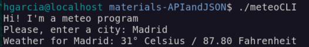

# 4.4 Access External Data

## Access data from the web

- When we access data "from outside", we're able to write way more and way more powerful programs
- **API** stands for Application Programming Interface: a set of protocols, tools, and standards that enable different software applications to communicate and interact with each other.
- It allows developers to access and use functionalities of a system or application without needing to understand or modify the underlying code.

## Access data through HTTP

- We can use HTTP (Hypertext Transfer Protocol) to access data from the internet:

  1. Client sends a request (HTTP request) to the server
  2. The server replies with a response (HTTP response)

## The program `curl`: overview

- `curl` is a program that allows us to transfer data over multiple protocols (HTTP, HTTPS, FTP, SFTP,...)
- Data retrieval: Fetch and display web pages or API content
- It's especially useful to integrate it into shell scripts
- To install it:

  - Mac: `brew install curl`
  - Ubuntu: `sudo apt-get install curl`

- Most important parameters for `curl`:

  - ` - -v / --verbose` >> Displays detailed information about the request and response, useful for debugging
  - `-o / --output` >> Saves the response to a file instead of displaying it in the
    console
  - `-L / --location` >> Follows HTTP redirects (3xx) to retrieve the final resource
  - `-s / --silent` >> Silent mode: Do not display progress meter / error data - It still outputs the data we're accessing

## What is JSON?

- JSON stands for JavaScript Object Notation: A format for the exchange of structured data between different applications, particularly on the web
- File extension: .json
- Originally derived from the JavaScript programming language, however, .json files can be processed by many programming languages
- Syntax:

  - Elements consist of key-value pairs: `{"firstname": "Jannis"}`
  - Related entries are represented as objects in curly braces `{...}`
  - Objects and list ("arrays" with the square braces: `[...]`) can be nested arbitrarily within each other Jannis Seemann - Bash & Linux CLI

## The program: jq

- How do we process JSON in our bash? Unfortunately, this is not build-in. But we can use a separate program: `jq`
- This program allows us to easily access JSON and parse it
- It's a complete programming language, that allows way more than to just access an element in JSON but we will use it mostly for that

## **_EXERCISE_**

        - Create a program (bash-file), that asks the user to enter the name of a city ("London", "New York",...)
        -  It should then send a request to my weather API, to fetch the current temperature
        - This temperature is in °C. Depending on your preferences, you might want to convert it to °F - for example with the program "bc".
        - Mock API: https://downloads.codingcoursestv.eu/055%20-

%20bash/api/api.php?city=Budapest

**Solution**

```bash
#!/usr/bin/bash

echo "Hi! I'm a meteo program"

echo -n "Please, enter a city: "

read -r city

response=$(curl "https://downloads.codingcoursestv.eu/055%20-%20bash/api/api.php" -s -G --data-urlencode "city=${city}")
temperature=$(echo "${response}" | jq ".temperature")
temp_fahrenheit=$(echo "scale=2; (${temperature} * 9 / 5) + 32" | bc )
# We use bc program as it supports floating-point arithmetic. Shell Arithmetic is fine just for integer-only calculations

echo "Weather for ${city}: ${temperature}° Celsius / ${temp_fahrenheit} Fahrenheit"
```


